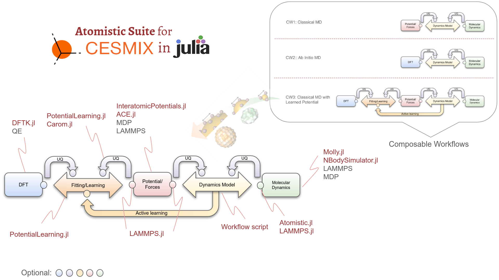
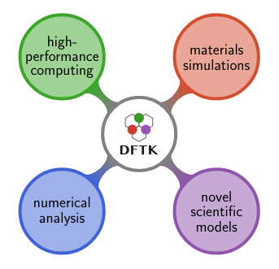
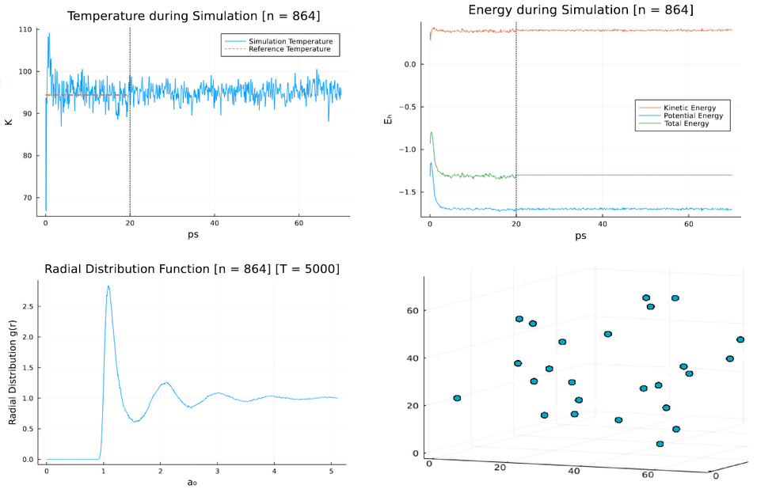

# [WIP] Composable and differentiable active-learning workflows for material simulations in Julia

Computational modeling of the chemical and physical properties of matter is indispensable in materials science research. This practice has been reinforced by the increase in computing power at a relatively low cost and by the facilities provided by high performance software tools, as well as the latest advances in programming languages and compilers. In this context, the **Center for Exascale Simulation of Materials in Extreme Environments ([CESMIX](https://computing.mit.edu/cesmix/))**, with the participation of the [**Julia Lab**](https://julia.mit.edu/), aims to **advance the state-of-the-art in predictive simulation by connecting quantum and molecular simulations of materials with cutting-edge programming languages, compiler technologies and high performance engineering tools, using uncertainty quantification as the axis of integration**. As motivating problem, CESMIX aims to predict the degradation of complex materials under extreme loading, particularly ultra-high temperature ceramics in hypersonic flows.

One of the key challenges is the implementation of **composable workflows** that simplify the combination of different software tools under a single interface, allowing **deep integration** with the whole system. Increased accessibility in software development benefits atomistic ecosystems but also increases overlapping functionality. Furthermore, horizontal hierarchies of large scientific communities make it difficult to reach consensus. Proper integration of atomistic software broadens the spectrum of possible workflows, addresses emerging issues, such as the management of parallel resources of concurrently running libraries, and therefore catalyzes advances in these areas of interest.

## Julia can help!

The **[Julia programming language](https://julialang.org/)**, and its strong ecosystem for **scientific computing**, offer key elements for addressing CESMIX's challenges. Julia solves a common problem in scientific computing, that is, prototyping algorithms in a user-friendly language, and then having to rewrite them in a faster language. It is committed to facilitating development by providing several features that encourage **high-level code** that is readable, flexible, extensible, and that abstract performance management. Julia is **easy** and **fast**, looks like Python but runs like C. It is **dynamically typed**, but with support for **optional type declarations**. It feels like a scripting language but can be compiled to **efficient native code** for multiple platforms via LLVM. 

One of the crucial mechanisms of this language is [**multiple dispatch**](https://www.youtube.com/watch?v=kc9HwsxE1OY), allowing dynamically dispatching a function or method based on the run-time type of the arguments. This feature facilitates **software composability**, and in turn, the development of integrated workflows. Multiple dispatch helps in the composition of novel **machine learning interatomic potentials**, promising the accuracy of first-principles methods at a lower cost of computation, by combining **density functional theory (DFT)** [data](https://github.com/FitSNAP/FitSNAP/blob/master/examples/Ta_XYZ/XYZ/Displaced_A15.xyz) (energies, forces, and virials), descriptors (**SNAP, ACE, SOAP, POD**, etc), and learning methods (from least-squares regressions to [graph neural networks](https://github.com/CarloLucibello/GraphNeuralNetworks.jl)). This feature also enables a **deep integration**, the software that is extended is seamlessly incorporated into the atomistic workflow. Furthermore, multiple dispatch allows expressing **object-oriented** and **functional** programming patterns.

[**Differentiable programming**](https://fluxml.ai/blog/2019/02/07/what-is-differentiable-programming.html), which applies the methods of deep learning to complex existing programs, is another key point. A differentiable language can **compute gradients across multiple languages and simulation codes**, expanding the way machine learning is thought of. In the context of atomistic simulations, it can accelerate the development by automatically calculating **loss function** gradients in neural network potential training, calculating **interatomic forces** and the **sensitivity** of different QoI, optimizing atom properties, searching for a **minimum energy** bond angle, etc. Differentiable programming **enables uncertainty quantification**, an increasingly important practice that provides insight into the reliability of atomistic simulations, and that can be used as an integration axis in an active-learning workflow. For this purpose, Julia relies on powerful **automatic differentiation (AD)** tools, such as **[Zygote](https://fluxml.ai/Zygote.jl/latest/)** or **[Enzyme](https://enzyme.mit.edu/julia/)**, the latter matching or **exceeding state-of-the-art AD tool performance**.

Julia also has a diverse ecosystem. The **[SciML](https://sciml.ai/)** libraries are open source software created to unify packages for **scientific machine learning**. They provide tools such as **[Optimization.jl](https://github.com/SciML/Optimization.jl)**, which brings together several optimization packages into one unified Julia interface. The developments can be also accelerated using **HPC and machine learning abstractions**, e.g., **[Flux.jl](https://fluxml.ai/Flux.jl/stable/)** makes parallel training simpler using the NVIDIA GPU abstractions of **[CUDA.jl](https://github.com/JuliaGPU/CUDA.jl)**. 
In addition, an increasing number of Julia packages dedicated to atomistic simulations are currently being developed, many of them under **[JuliaMolSim](https://juliamolsim.github.io/)**, an organization about molecular simulations in Julia. These packages combine the dynamic and interactive nature of Julia with its high-performance capabilities. Among them is **[ACE.jl](https://github.com/ACEsuit/ACE.jl)**, which implements approximation schemes for symmetric functions (including invariant scalars, equivariant vectors and tensors). Another important toolbox is **[Molly.jl](https://juliamolsim.github.io/Molly.jl/stable/)**, it is the most advanced pure Julia package for MD, from noble gases to biological macromolecules, and for simulation of physical systems in general. **[Chemellia](https://chemellia.org/)** is gaining a lot of attention, it is a machine-learning ecosystem for systems made of atoms in Julia and provides packages such as **[ChemistryFeaturization.jl](https://chemistryfeaturization.chemellia.org/dev/)**, an interface for translating atomic structures into data structures and sets of features to be used in machine learning models. **AtomsBase.jl** and **DFTK.jl** are part of the JuliaMolSim and CESMIX stack and will be introduced in the next section.


## The atomistic suite for CESMIX in Julia

In line with these ongoing efforts, a differentiable multi-scale software stack for the integration of materials simulations is being implemented in CESMIX. The goal is to facilitate the development and accelerate the simulations in this project. Furthermore, the aim is to show that it is possible to **address these simulations using a single high-level programming language without compromising performance**. In doing so, it is expected to expand the atomistic ecosystem in Julia as well as the **user community**, and to contribute to **better integration** of this ecosystem with state-of-the-art software.

Applying composability to the atomistic ecosystem requires characterizing the high-level software components involved and their interactions. We identified these components organized in the following composable workflows: Classical MD, Ab Initio MD, and Classical MD with active learning.

<p align="center">

</p>

Essentially, in a **classical MD** simulation, at each time step, the force associated with each atom is calculated from an interatomic potential and then used to calculate each new atomic position. The **Ab initio MD** process is mostly analogous, but the force calculation is provided by a DFT simulation. In the **classical MD with active learning**, the DFT data is fitted to a data-driven interatomic potential, such as ACE or SNAP. Then, the potential is used in the MD simulation. In the active learning process, when the uncertainty quantification components flag an issue, e.g. the fitting error is too high or an instability on a QoI of the MD is detected, a corrective action is triggered. This action can be to return to a previous checkpoint, re-fit the potential, and re-run the MD time segment.

The following is a brief description of the main Julia components that are currently being integrated into the software stack, and are either being developed at CESMIX or are part of CESMIX collaborations.

**[AtomsBase.jl](https://github.com/JuliaMolSim/AtomsBase.jl)**. This package is a lightweight abstract interface for the representation of **atomic geometries** in Julia and helps in the operability of diverse atomistic tools. A flexible implementation of the interface is provided by the FlexibleSystem and the Atom structs, using an **array-of-structs** style. 

```julia
struct Atom{D, L<:Unitful.Length, V<:Unitful.Velocity, M<:Unitful.Mass}
    position::SVector{D, L}
    velocity::SVector{D, V}
    atomic_symbol::Symbol
    atomic_number::Int
    atomic_mass::M
    data::Dict{Symbol, Any}
end

struct FlexibleSystem{D, S, L<:Unitful.Length} <: AbstractSystem{D}
    particles::AbstractVector{S}
    box::SVector{D, SVector{D, L}}
    boundary_conditions::SVector{D, BoundaryCondition}
end
```

On the other hand, the FastSystem contains an implementation of AtomsBase based on the **struct-of-arrays** approach, where all species data is stored as plain arrays. Another package, **[AtomIO.jl](https://github.com/mfherbst/AtomIO.jl)** will help to save and load these structures.
```julia
struct FastSystem{D, L <: Unitful.Length, M <: Unitful.Mass} <: AbstractSystem{D}
    box::SVector{D, SVector{D, L}}
    boundary_conditions::SVector{D, BoundaryCondition}
    positions::Vector{SVector{D, L}}
    atomic_symbols::Vector{Symbol}
    atomic_numbers::Vector{Int}
    atomic_masses::Vector{M}
end
```

**[DFTK.jl](https://github.com/JuliaMolSim/DFTK.jl)**. The density-functional toolkit, a library for playing with plane-wave DFT algorithms which in its basic formulation solves periodic Kohn-Sham equations. DFTK performance is of the same order of magnitude as much larger production codes such as Abinit, Quantum Espresso and VASP. DFTK aims to open a bridge between communities, enabling numerical analysis, hpc, and at the same time having a code that is useful for simulations and for developing new models.
<p align="center">

</p>


**[InteratomicPotentials.jl](https://github.com/cesmix-mit/InteratomicPotentials.jl)**. This package creates abstract structures and interfaces for common **empirical** and **machine-learning or data-driven interatomic potentials**. The key functionality is to provide access to **energies**, **forces**, and **virials** of atomic configurations for each of the implemented potentials.
Currently, the implemented potentials are Lennard Jones, Born Mayer, Coulomb, ZBL, and Morse. An extension of this package, **[InteratomicBasisPotentials.jl](https://github.com/cesmix-mit/InteratomicBasisPotentials.jl/)**, implements **SNAP**, and an interface o **[ACE1.jl](https://github.com/ACEsuit/ACE1.jl)**. New potentials are also being developed, such as potentials for molecules or compositions of neural networks with potential descriptors.

In the example below, the integration with AtomsBase and the definition of an atomistic configuration are presented. Then, an empirical potential is defined and used to compute the energies, forces, and virials of the system. 

```julia
atom1 = Atom(element, ( @SVector [1.0, 0.0, 0.0] ) * 1u"Å")
atom2 = Atom(element, ( @SVector [1.0, 0.25, 0.0] ) * 1u"Å")
box = [[1., 0.0, 0.0], [0.0, 1.0, 0.0], [0.0, 0.0, 1.0]] * 1u"Å"
bcs = [DirichletZero(), Periodic(), Periodic()]
system   = FlexibleSystem(atoms, box , bcs)

ϵ = 1.0 * 1u"eV"
σ = 0.25 * 1u"Å"
rcutoff  = 2.25 * 1u"Å"
lj       = LennardJones(ϵ, σ, rcutoff, [element])  

pe       = potential_energy(system, lj)
f        = force(system, lj)
v        = virial(system, lj)
v_tensor = virial_stress(system, lj)  
```

Something interesting about multiple dispatch is that once the software packages are installed, they can be **extended without the need to modify the original software**. Once the new software has been defined, respecting the interfaces, it is **automatically integrated into the entire system**. Composability is more than modularity, it allows a deep integration of the new extended software with the entire atomistic suite A simple example is presented below, where **a new interatomic potential is defined**, using the InteratomicPotentials.jl interface. There is no need to  create a PR to that package, and the new potential is now part of the entire suite.

```julia
 struct SimpleNNPotential <: AbstractPotential
   nn
   nn_params
end

function potential_energy(R::AbstractFloat,
                           p::SimpleNNPotential)
   return p.nn(R)
end

function force(R::AbstractFloat,
                r::SVector,
                p::SimpleNNPotential)
   dnndr = first(gradient((x)->p.nn(norm(x)), r))
   return -dnndr
end
```
 
```julia
model = Chain(Dense(1,32,Flux.relu),
              Dense(32,32,Flux.relu), Dense(32,1))
nn(R) = first(model([R]))
nn_params = Flux.params(model)

p = SimpleNNPotential(nn, nn_params)

potential_energy(1.0, p)

r_diff = SVector(1.0, 1.0, 1.0)
force(norm(r_diff), r_diff, p)
```

**[PotentialLearning.jl](https://github.com/cesmix-mit/PotentialLearning.jl)**. This is a package for active learning of interatomic potentials. Like the other packages, it incorporates elements from differentiable programming, software composability, and HPC. In addition, it will incorporate elements from **bayesian inference / machine learning for determining optimal parameters of interatomic potentials** (hyper-parameter optimization, least-squares regressions, neural network training, etc.) as well as its **uncertainties**, and **sensitivities** of QoI from MD simulations. Work is underway to provide intelligent data **subsampling** (through DPP or clustering), and useful functions to process input data so that it is ready for training (e.g. read XYZ file with atomic configurations, linearize forces, split the dataset into training and testing, normalize data, transfer data to GPU, define iterators, subsample the dataset, etc.). Finally, post-processing: computation of different metrics (MAE, RSQ, COV, etc), saving results, and plotting.

**[Atomistic.jl](https://github.com/cesmix-mit/Atomistic.jl/)**. This package provides an integrated workflow for MD simulations. It provides **an interface to [Molly.jl](https://juliamolsim.github.io/Molly.jl/dev/) and [NBodySimulator.jl](https://github.com/SciML/NBodySimulator.jl)** that allows to define and run the MD simulation, and post-process its results. Atomistic.jl is compatible with any interatomic potential that implements the abstract interface defined by InteratomicPotentials.jl. 

The code below shows an implementation of the CW1, that describes a classical  MD  simulation. It is based on an Argon system with 864 atoms and LJ. The example integrates AtomsBase.jl, InteratomicPotentials.jl, and the MD uses the Molly.jl. CESMIX is collaborating with the developments of this MD tool and accelerating its execution.

<!-- Based on this guide: https://ase.tufts.edu/chemistry/lin/images/FortranMD_TeachersGuide.pdf -->

```julia
N = 864
box_size = 3.47786u"nm"
reference_temp = 94.4u"K"
coupling_factor = 10 # this number was chosen arbitrarily
Δt = 1e-2u"ps"

initial_system = generate_atoms_in_cubic_cell(N, :Ar, box_size, reference_temp)

eq_steps = 2000
eq_thermostat = Molly.AndersenThermostat(reference_temp, Δt * coupling_factor)
eq_simulator = MollySimulator(Δt, eq_steps, coupling=eq_thermostat)
potential = InteratomicPotentials.LennardJones(1.657e-21u"J", 0.34u"nm", 0.765u"nm", [:Ar])
eq_result = simulate(initial_system, eq_simulator, potential)

prod_steps = 5000
prod_simulator = MollySimulator(Δt, prod_steps, t₀=get_time(eq_result))
prod_result = simulate(get_system(eq_result), prod_simulator, potential)
```

In case there is an interest in working with NBS instead of Molly, from the user perspective only a few changes are needed: mainly in the thermostat and the definition of the simulator. 

```julia
N = 864
box_size = 3.47786u"nm"
reference_temp = 94.4u"K"
thermostat_prob = 0.1 # this number was chosen arbitrarily
Δt = 1e-2u"ps"

initial_system = generate_atoms_in_cubic_cell(N, :Ar, box_size, reference_temp)

eq_steps = 2000
eq_thermostat = NBodySimulator.AndersenThermostat(austrip(reference_temp), thermostat_prob / austrip(Δt))
eq_simulator = NBSimulator(Δt, eq_steps, thermostat=eq_thermostat)
potential = InteratomicPotentials.LennardJones(1.657e-21u"J", 0.34u"nm", 0.765u"nm", [:Ar])
eq_result = simulate(initial_system, eq_simulator, potential)

prod_steps = 5000
prod_simulator = NBSimulator(Δt, prod_steps, t₀=get_time(eq_result))
prod_result = simulate(get_system(eq_result), prod_simulator, potential)
```

Also, this tool abstracts the generation of plots of the simulation results: temperature, different energies, and radial distribution function, among others.
 
<p align="center">

</p>


**[LAMMPS.jl](https://github.com/cesmix-mit/LAMMPS.jl)**. LAMMPS.jl is a **wrapper to LAMMPS** and allows a direct interaction without round-tripping through Python. This module allows to access SNAP and execute MD simulations. This package is key for communicating the efforts made in Julia with state-of-the-art tools implemented in other technologies.


**[Atomistic Composable Workflows](https://github.com/cesmix-mit/AtomisticComposableWorkflows)**. This repository aims to gather **easy-to-use CESMIX-aligned case studies**, integrating the latest developments of the Julia atomistic ecosystem with state-of-the-art tools. Although this is a work in progress some examples are ready to be used, in particular, there is a documented example about **how to install** the atomistic suite, **fit different DFT datasets using ACE**, run multiple serial/parallel fitting experiments, and **run an MD simulation**.


**[MLP.jl](https://github.com/cesmix-mit/MLP)** and **[MDP.jl](https://github.com/cesmix-mit/MDP)**. These libraries, developed for CESMIX, have objectives aligned to the described suite. In particular, to **fit and evaluate POD/SNAP/ACE potentials**, generate and **select configurations** to perform DFT calculations and obtain training data, develop **neural networks and graph neural network potentials** by leveraging AD for the differentiation of the loss function, and **run MD simulations**. The intent is to integrate these components to achieve a unified system in the project.

In the future, it is also planned to add to the integrated stack tools such as **[OpenCilk](https://www.opencilk.org/)**, that simplifies **extending a serial program to a parallel program**, **[FluxRM](https://github.com/flux-framework/FluxRM.jl)**, which helps the **resource management of competing libraries** running simultaneously, and **[Spindle](https://github.com/hpc/Spindle)**, which addresses problems that arise when using **dynamically linked libraries on large clusters** and supercomputers.

## Final remarks

An atomistic ecosystem is flourishing in Julia. Efforts are being made to synchronize and integrate with the state-of-the-art, both in terms of features and performance. Tools such as AtomsBase.jl and InteratomicPotentials.jl aim to bring together several packages related to atomic configurations and potentials into **one unified Julia interface**, as well as to provide some very useful implementations. Linked to this, Atomistic.jl is making the manipulation of **MD simulations more transparent**, making it easier to access Molly.jl and NBodySimulator.jl. In addition, **uncertainty quantification** features are being cooked in PotentialLearning.jl or Carom.jl, intended to be used as a workflow **integration backbone**. Also, work on **machine learning potentials** is being done in the aforementioned packages and others such as MLP.jl, MDP.jl, and ChemistryFeaturization.jl. In particular, facilitating their definition by providing user-friendly interfaces and the reuse of atomic descriptors from different implementations promises a better way to **improve performance without sacrificing the accuracy** of first-principles methods. The impact on **differentiability** extends to almost all packages. Particularly, Enzyme not only is **far faster**, even on existing Julia code, but it allows Julia to **import foreign code** (such as C++ LAMMPS, Fortran libs, etc) and be differentiated. All these efforts enable **composability**, a key ingredient for working with and enhancing **heterogeneous codes and technologies**, specifically through developments such as LAMMPS.jl. 

Work is increasingly organic with initiatives such as **CESMIX** or **JuliaMolSim**.
New developments are being born, while others are growing stronger.
Julia could reshape the next generation of atomistic simulation software by **giving control back to domain scientists** and rethinking scientific software through **differentiable programming**. 
Julia can prove that it is possible to address these simulations using **a single high-level programming language without compromising performance**.
If you are interested in these topics and want to make your mark in this thriving ecosystem, **we are waiting for you**.


## References

This post has been generated from the documentation and presentations of the CESMIX project, as well as from the online documentation of the mentioned tools.

